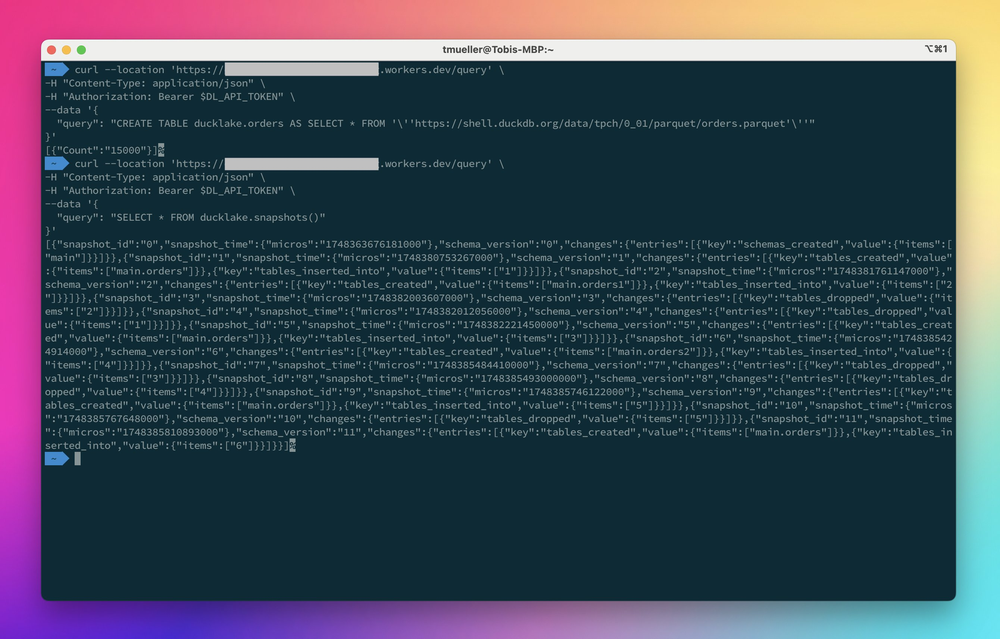
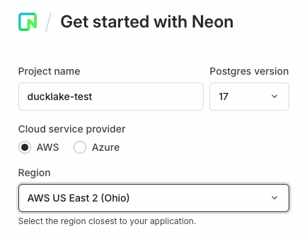
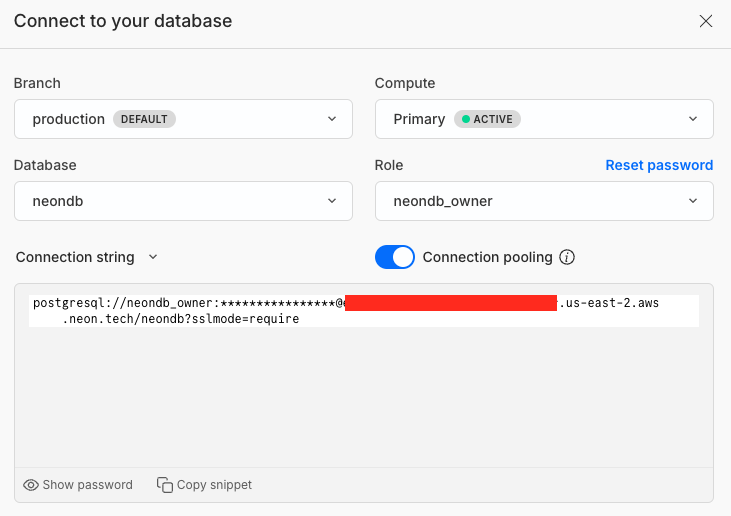

# cloudflare-ducklake
Running [DuckLake](https://ducklake.select/) on Cloudflare Containers, with DuckDB running as a Hono-based API.



## Build image locally
Before being able to build the Docker image locally, you have to download the DuckDB extensions we'd like to package into the image, so that they don't need to be downloaded on each container start:

```bash
scripts/download_extensions.sh
```

Once this is done, you can run the following to build the image locally:
```bash
npm run build:docker
```

## Run the image locally
To run the newly built image locally, run

```bash
npm run dev:docker
```

To query the DuckDB API within the locally running container, use

```bash
curl --location 'http://localhost:8080/query' \
--header 'Content-Type: application/json' \
--data '{
  "query": "SELECT * FROM '\''https://shell.duckdb.org/data/tpch/0_01/parquet/orders.parquet'\'' LIMIT 1000"
}'
```

**Hint:**
Currently it's **not possible** to use `wrangler dev` during local development. I guess this will eventually change once Containers become GA.

### DuckDB API
DuckDB is exposed as a Hono.js-based API, that offers a few endpoints:

* `GET /`: Will show a JSON welcome message
* `GET /_health`: Enables potential container health checking (currently not used)
* `POST /query`: Takes a `application/json` object body with a `query` property that contains the (encoded) SQL query. Returns the query result in `application/json` as well (see example above)
* `POST /streaming-query`: Takes a `application/json` object body with a `query` property that contains the (encoded) SQL query. Returns the query result in `application/vnd.apache.arrow.stream` (Arrow data stream)

### Securing the API
You can generate a unique API Token, e.g. with a tool like [Strong Password Generator](https://1password.com/password-generator) NOTE: it needs to satisfy the requirements in [Hono's Bearer Auth Middleware](https://hono.dev/docs/middleware/builtin/bearer-auth) - namely satisfying this regex: `/[A-Za-z0-9._~+/-]+=*/`. 

Then deploy a Workers secret named `API_TOKEN` that will automatically be used to secure the `/query` endpoint once it's present, with the below script:

```bash
scripts/setup_api_secrets.sh
```

If you want to test this locally, too, you need to create a `.dev.vars` file in the root directory of this project. This will be appended for R2 Data Catalog & DuckLake usage later if you want to try these before deployment as well.

### Create a R2 bucket
If you want to either deploy the DuckLake or the Apache Iceberg integration via R2 Data Catalog, you have to set up a R2 bucket first. To create a new R2 bucket, you can run the following:

```bash
scripts/setup_r2.sh YOUR-BUCKET-NAME
```
where `YOUR-BUCKET-NAME` is your desired name for the bucket. It will automatically add the respective environment variables to `.dev.vars`. You'll also need the bucket name later for settng up the DuckLake secrets.

If you'd want to set a [location hint](https://developers.cloudflare.com/r2/reference/data-location/#location-hints) or a [jurisdiction](https://developers.cloudflare.com/r2/reference/data-location/#available-jurisdictions), please edit the script accordingly before running it.

## Deployment with DuckLake
[DuckLake](https://ducklake.select/) was announced on 2025-05-27. It represents a new table format. Read more about it at:
* [Manifesto](https://ducklake.select/manifesto/)
* [Specification](https://ducklake.select/docs/stable/specification/introduction)
* [Podcast episode](https://www.youtube.com/watch?v=zeonmOO9jm4)
* [FAQs](https://ducklake.select/faq)

### Setting up a catalog database
As we want to deploy it in a multi-user fashion, we need a transactional client-server database, such as MySQL or Postgres as backing store for the catalog data. 

We chose [neon.tech](https://neon.tech), because it's serverless, and it offers a free tier of 0.5GB storage, which should be enough to get started.

Once you initially signed-up, you can choose the project name, cloud provider and the region:


After you clicked on "Create project", you get directly taken to your Dashboard. The next step is to get the connection details. Therefore, click on the "Connect" button in the upper-right corner:



Note the following connection parameters, and their equivalent environment variable/secret names (and add them to the `.dev.vars` file):
* The user (`POSTGRES_USER`)
* The password (`POSTGRES_PASSWORD`)
* The hostname (`POSTGRES_HOST`)
* The database name (`POSTGRES_DB`)

You can also create another user, and use this if you don't want to use the main instance user.

### Getting a R2 Access Token
Please follow the instructions in the R2 docs on [how to create an API token](https://developers.cloudflare.com/r2/data-catalog/get-started/#3-create-an-api-token). 

You'll need to store this token in a secure location (and eventually in `.dev.vars` if you want to use the R2 Data Catalog when running the Docker image locally), as you'll need later for the R2 Data Catalog deployment.

Also, please note the the S3 APIs Access Key (`R2_ACCESS_KEY_ID`) and Secret Key (`R2_SECRET_ACCESS_KEY`), as well as your Cloudflare account ID (`R2_ACCOUNT_ID`), you'll need them in the next step. Put them in `.dev.vars` as well if you want to run it locally.

### Create secrets for DuckLake
Running the following script will create eight new Workers secrets needed for deployment:

```bash
scripts/setup_ducklake_secrets.sh
```

### Deployment
If you followed the above steps, you can now run the actual deployment. This will create a Worker, a DurableObject, build the Docker image locally and the upload it to the Cloudflare container registry.

**Hint: You need access to Cloudflare containers beta to be able to deploy it to Cloudflare!**

```bash
npm run deploy
```

### Running queries

#### Workers service
Replace the `WORKERS_URL` with the real URL, and the `API_TOKEN` with your real API token:

```bash
curl --location 'https://WORKERS_URL/query' \
--header 'Content-Type: application/json' \
--header 'Authorization: Bearer API_TOKEN' \
--data '{
  "query": "CREATE TABLE ducklake.orders AS SELECT * FROM '\''https://shell.duckdb.org/data/tpch/0_01/parquet/orders.parquet'\''"
}'
```
The response should look like this:
```json
[
  {"Count":"15000"}
]
```

Get the first row of the new table:
```bash
curl --location 'https://WORKERS_URL/query' \
--header 'Content-Type: application/json' \
--header 'Authorization: Bearer API_TOKEN' \
--data '{
  "query": "SELECT * FROM ducklake.orders LIMIT 1"
}'
```

The response should look like this:
```json
[
  {
    "o_orderkey": 1,
    "o_custkey": 370,
    "o_orderstatus": "O",
    "o_totalprice": 172799.49,
    "o_orderdate": {
      "days": 9497
    },
    "o_orderpriority": "5-LOW",
    "o_clerk": "Clerk#000000951",
    "o_shippriority": 0,
    "o_comment": "nstructions sleep furiously among "
  }
]
```

## Deployment with the additional R2 Data Catalog / Iceberg integration
With the `v1.3.0` release of DuckDB, it became possible to connect to the R2 Data Catalog. This means that you can now also read Iceberg data from R2's Object Storage directly from a SQL statement issued by DuckDB.

### Enable R2 Data Catalog for existing R2 bucket
You can enable the Apache Iceberg support via the R2 Data Catalogby running the following command:

```bash
scripts/setup_r2_data_catalog.sh YOUR-BUCKET-NAME
```
where `YOUR-BUCKET-NAME` is the name for the bucket you used in the R2 bucket creation step before.

### Getting the R2 Data Catalog information
The information about the R2 Data Catalog URI (`R2_ENDPOINT` secret) and warehouse name (`R2_CATALOG` secret) can be gathered by running:

```bash
scripts/get_catalog_info.sh YOUR-BUCKET-NAME
```
where `YOUR-BUCKET-NAME` is the name for the bucket you used in the R2 bucket creation step before.

Please also store this information, because you'll need in in the next step. Also, please add the three variables to `.dev.vars` if you want to use the R2 Data Catalog when running the Docker image locally.

### Creating secrets for R2 Data Catalog
To create the necessary Workers secrets, run:

```bash
scripts/create_r2_data_catalog_secrets.sh
```
and copy & paste the respective values you noted in the last two steps.

### Writing Iceberg example data
As we need some example data if we want to test the new Iceberg capabilities, we need to create this data manually with a [Python script](scripts/python/create-iceberg-data.py).

For convenience, we'll use [Marimo](https://marimo.io) for this. It requires a working Python installation on your machine.

#### Setup Marimo
To setup Marimo, run the following npm task:

```bash
npm run iceberg:setup
```

This will create a new directory and install Marimo and some dependencies in a virtual environment.

#### Create the Iceberg example data
To create the Iceberg example data, run the following npm task:

```bash
npm run iceberg:create
```

This will start Marimo, and load the respective Python script. You'll need to edit the variables for `WAREHOUSE`, `CATALOG_URI` and `TOKEN` with the values gathered in the last steps. This is also described in the [R2 Data Catalog docs](https://developers.cloudflare.com/r2/data-catalog/get-started/#6-create-a-python-notebook-to-interact-with-the-data-warehouse).

After you did that, you can run the Python cells in the Marimo notebook, and should end up with some data created in the R2 Bucket. You can check in the Cloudflare Dashboard, or via `wrangler`.

### Running DuckDB with Iceberg support
Once you created the secrets as outlined above (all of them!), the application will automatically create a DuckDB secret for accessing the R2 Data Catalog, and attach the catalog as well under the name of `r2lake` when it starts. The example table created in the last step is called `people` and was created in the `default` schema.

### Deployment
If you followed the above steps, you can now run the deployment. This will update the existing deployment when you already deployed the DuckLake configuration.

**Hint: You need access to Cloudflare containers beta to be able to deploy it to Cloudflare!**

```bash
npm run deploy
```
The `wrangler` deployment output shows the workers URL where the service can be reached. Note it down if you want to run test queries (`WORKERS_URL` in the step below).

### Running queries

#### Workers service
Replace the `WORKERS_URL` with the real URL, and the `API_TOKEN` with your real API token:

```bash
curl --location 'https://WORKERS_URL/query' \
--header 'Content-Type: application/json' \
--header 'Authorization: Bearer API_TOKEN' \
--data '{
  "query": "SELECT * FROM r2lake.default.people"
}'
```

#### Locally
Replace the `API_TOKEN` with your real API token and run the following:

```bash
curl --location 'http://localhost:8080/query' \
--header 'Content-Type: application/json' \
--header 'Authorization: Bearer API_TOKEN' \
--data '{
  "query": "SELECT * FROM r2lake.default.people"
}'
```

This should return the response below:
```json
[
  {
    "id": "1",
    "name": "Alice",
    "score": 80
  },
  {
    "id": "2",
    "name": "Bob",
    "score": 92.5
  },
  {
    "id": "3",
    "name": "Charlie",
    "score": 88
  }
]
```